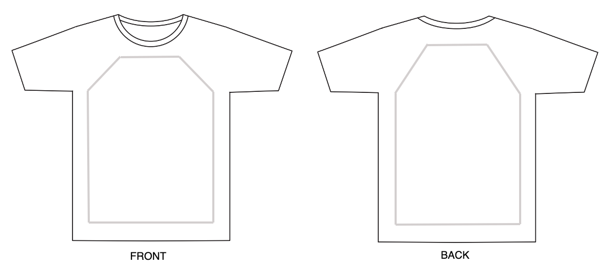
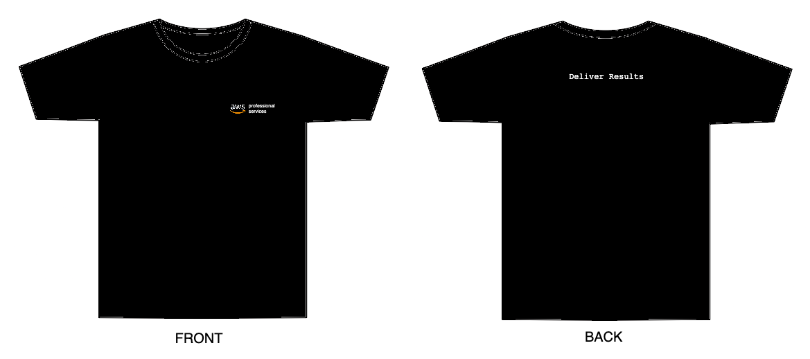

# AWS ProServe TW T-shirt

AWS Professional Services had been looking for a T-shirt design for official speaking opportunities and ProServe Project Delivery Workshops for many years. However, there is no such process for the team to organize everyone's idea and start the purchasing process.

This repository is the code and documentation of the development process to build a visualized Standard of Process (SOP) for the team.

Once the design is confirmed, ProServe will make `100` T-shirts for future events.

## Stages

After the confirmation with Candy, the process is separated into these stages:
 - Project Announcement
   - Schedule
 - Design Submission
 - Vote
 - Result Reveal
 - Confirmation with Marketing
   - On design
 - Contact Agency
 - Wait for the T-shirts

## Schedule

The webpages for each process will be created before the event date:
 - 2022-01-24: Project Announcement
 - 2022-01-24 ~ 2022-02-11: Design Submission
 - 2022-02-14 ~ 2022-02-15: Voting Dates
 - 2022-02-16: Result Reveal and Wait

### Template

### Design Information

 - Should be Professional
 - Keep the design simple
 - Keep the design within the gray area
 - Remove the gray area during design
 - Feel free to change the base color
 - One person is limited to 1 design, new submission will replace the old one

### Sample

